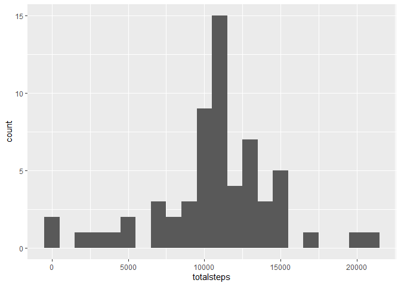
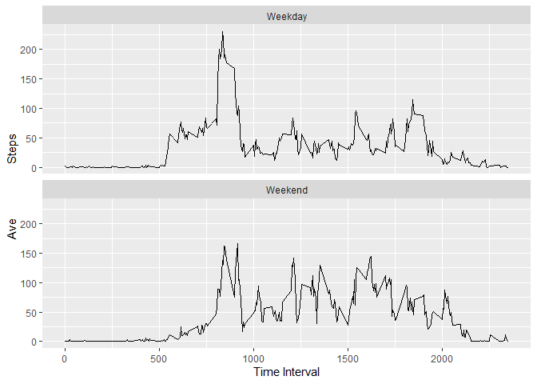

Reproducible Research- Assignment 1
================
ME
February 20, 2020

Assignment 1
============

Step 1: Loading the data
------------------------

The following code loads the pre-downloaded dataset into R into a object called "dataset".

``` r
        dataset<-read_csv("activity.csv")
```

    ## Parsed with column specification:
    ## cols(
    ##   steps = col_double(),
    ##   date = col_date(format = ""),
    ##   interval = col_double()
    ## )

Step 2: What is the mean total number of steps taken per day?
-------------------------------------------------------------

1.Calculate the total number of steps taken per day?
-using dplyr functions to summarize data and grouped data is stored in group1 variable

``` r
        group1<-dataset%>%group_by(date)%>%summarize(totalsteps=sum(steps))
        head(group1)
```

    ## # A tibble: 6 x 2
    ##   date       totalsteps
    ##   <date>          <dbl>
    ## 1 2012-10-01         NA
    ## 2 2012-10-02        126
    ## 3 2012-10-03      11352
    ## 4 2012-10-04      12116
    ## 5 2012-10-05      13294
    ## 6 2012-10-06      15420

2.Make a Histogram of the total number of steps taken each day.
-Histogram is plot using ggplot2 package

``` r
        plot1<-ggplot(group1,aes(totalsteps))+geom_histogram(binwidth=1000)
        print(plot1)
```

    ## Warning: Removed 8 rows containing non-finite values (stat_bin).


``` r
        #ggsave("plot1.png")
```

3.Calculate and report the mean and median of the total number of steps taken each day
-Mean is calculated as follows with NA days removed:

``` r
        mean(group1$totalsteps,na.rm=T)
```

    ## [1] 10766.19

-Median is calculates as follows with NA days removed:

``` r
        median(group1$totalsteps,na.rm=T)
```

    ## [1] 10765

Step3: What is the average daily activity pattern?
--------------------------------------------------

1.  Make a time series plot of the 5-minute interval and the average number of steps taken averaged across all days.
    -using dplyr again to group by interval and summarize to get average

``` r
        group2<-dataset%>%group_by(interval)%>%summarise(averagesteps=mean(steps,na.rm=T))

        plot2<-ggplot(group2,aes(interval,averagesteps))+geom_line()
        print(plot2)
```


``` r
        #ggsave("plot2.png")
```

2.Which 5 minute interval on average contains the maximum number of steps?
-using subsetting and "which" function:

``` r
        group2[which(group2$averagesteps==max(group2$averagesteps)),]
```

    ## # A tibble: 1 x 2
    ##   interval averagesteps
    ##      <dbl>        <dbl>
    ## 1      835         206.

Step4: Inputting missing values...
----------------------------------

1.  Calculate and report total number of missing values in dataset.
    -create variable that filters to NAs (which are only found in steps variable)
    -sum column of NAs

``` r
        NAs<-which(is.na(dataset))
        group3<-dataset[NAs,]
        sum(is.na(group3$steps))
```

    ## [1] 2304

1.  Devise a strategy for filling in missing values inthe dataset
    -Populating missing values with interval mean

``` r
        #determine interval mean
        group4<-dataset%>%group_by(interval)%>%summarize(avesteps=mean(steps,na.rm=T))
        #create new column on group3 table (dataset filtered to NAs)
        group3<-left_join(group3,group4,by="interval")
        group3<-group3[,2:4] #drops steps column (with all NAs)
        head(group3)
```

    ## # A tibble: 6 x 3
    ##   date       interval avesteps
    ##   <date>        <dbl>    <dbl>
    ## 1 2012-10-01        0   1.72  
    ## 2 2012-10-01        5   0.340 
    ## 3 2012-10-01       10   0.132 
    ## 4 2012-10-01       15   0.151 
    ## 5 2012-10-01       20   0.0755
    ## 6 2012-10-01       25   2.09

1.  Create a New Dataset that is equal to the original dataset but with NAs filled in -Populate NA indexed rows with replacements

``` r
        dataset_clean<-dataset
        dataset_clean[NAs,"steps"]<-group3$avesteps
        head(dataset_clean)
```

    ## # A tibble: 6 x 3
    ##    steps date       interval
    ##    <dbl> <date>        <dbl>
    ## 1 1.72   2012-10-01        0
    ## 2 0.340  2012-10-01        5
    ## 3 0.132  2012-10-01       10
    ## 4 0.151  2012-10-01       15
    ## 5 0.0755 2012-10-01       20
    ## 6 2.09   2012-10-01       25

1.  Make a histogram of the total number of steps taken each day and calculate and report the mean and median total steps each day.
    -Histogram plotted same as in step 2

``` r
        group5<-dataset_clean%>%group_by(date)%>%summarize(totalsteps=sum(steps))

        plot3<-ggplot(group5,aes(totalsteps))+geom_histogram(binwidth=1000)
        print(plot3)
```



``` r
        #ggsave("plot3.png")
```

-Mean calculated as follows:

``` r
        mean(group5$totalsteps)
```

    ## [1] 10766.19

-Median calculated as follows:

``` r
        median(group5$totalsteps)
```

    ## [1] 10766.19

As the results show, inputting the interval average into the missing observations appears to leave the mean unchanged and the median only marginally shifted.

Step5: Are there differences in activity patterns between weekdays and weekends?
--------------------------------------------------------------------------------

1.  Create a new factor variable in the dataset with two levels "weekday" and "weekend"
    -use wday() function (from lubridate) to add "weekdays" variable defining day
    -create function to check "weekday" and assign factor, sapply over data
    -group data by interval and day class, average steps and plot

``` r
        dataset_clean$weekdays<-wday(dataset_clean$date)
        day_class<-function(x) if (x==1|x==7) {"Weekend"} else {"Weekday"}
        
        dataset_clean$dayclass<-as.factor(sapply(dataset_clean$weekdays,day_class))
        group6<-dataset_clean%>%group_by(dayclass,interval)%>%summarise(Avesteps=mean(steps))
        
        plot4<-ggplot(group6,aes(interval,Avesteps))+geom_line()+facet_wrap(~dayclass,ncol=1)+labs(y="Ave                 Steps",x="Time Interval")
        
        print(plot4)
```



``` r
        #ggsave("plot4.png")
```
